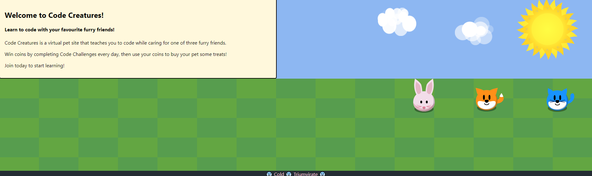
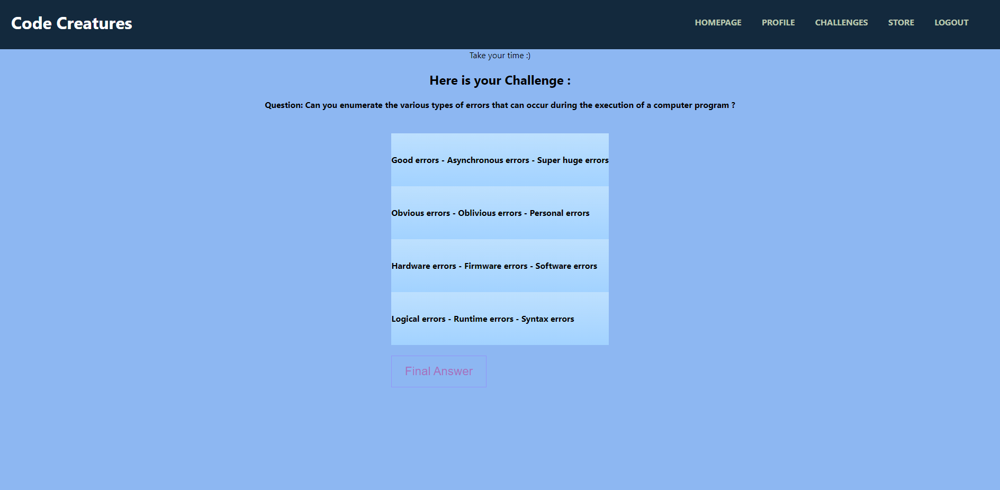

 []

  
 
## Code Creatures
<h3>
Pining for the innocent internet of the early 2000's ? Code Creatures gives you a fun space where anyone can nurture an online pet, 
and sharpen coding knowledge, all in one place!
</h3>
    <h4>

    “Tell me and I forget, teach me and I may remember, involve me and I learn.”– Benjamin Franklin 
 </h4> 

 

## Table of contents

    
- [Contributing](#contributing)
    
- [Description](#description)
    
    
- [Links](#links)
    

    
- [Screenshots](#screenshots)
    
- [Cold Triumvirate](#cold-tirumvirate)
    
## Description
 <h3>
 The Cold Triumvirate, wanted to make an app where people can practice coding challenges in a fun and relaxed enviroment.
 Earn experience and level up your pet by completeing challenging daily coding questions.

  By adding the pet/creature aspect of code interview prep, we have made a once stressful practice a leisurely expereince,
  in turn exposing children and people outside of the technical feild to useful knowledge and keys to the inevitable technological
  evolution of the modern world. 
 </h3>
 
  
 

  ## Links
  <h3> Github Repo:
<ul>
<li> <a href="https://github.com/Staycold/Code-creatures" target="_blank">https://github.com/Staycold/Code-creatures</a> </li>
</ul>

Heroku Deployed:

<ul>
    <li> <a href="https://cold-code-creatures.herokuapp.com/" target="_blank">https://cold-code-creatures.herokuapp.com/</a> </li>
    </ul>

</h3>

  ## Contributing
  
  If you would like to consider contributing towards further development of this project please contact any one of the team members below.

  ## Assets
  <ul>
  <li>Sun: http://clipart-library.com/clipart/BziXxdxcB.htm
  <li>Pet assets: https://comigo.itch.io/farm-puzzle-animals
  <li>Shopkeeper: https://heamomo.itch.io/white-dog
  <li>Fruit icons: https://gamedeveloperstudio.itch.io/fruits-icon-pack
  <li>Wood background: https://www.vecteezy.com/vector-art/2193057-wood-texture-background
  </ul>

  ## Screenshots

  
  

    ** Screenshots could differ from live expereince **

  ## Cold Tirumvirate
   
   <h3>
   
   Emily Gleeson:

<ul>
    
<li> <a href="https://github.com/gleeson-emily" target="_blank">GitHub</a> </li>
</ul>

  Patrick Brodie:
<ul>
<li> <a href="https://github.com/Staycold" target="_blank">GitHub</a> </li>
</ul>

Elison Liu:

<ul>
<li> <a href="https://github.com/elisonliu97" target="_blank">GitHub</a> </li>
</ul>
